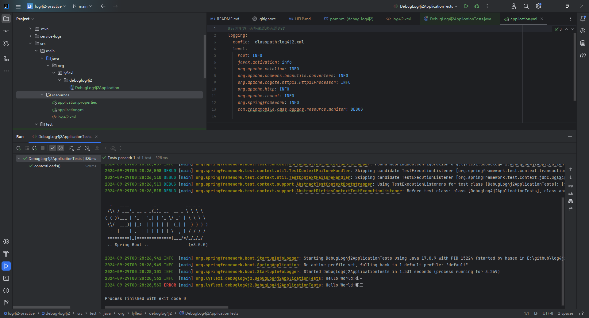

# log4j2-practice
log4j2模板调试2024最新版, 基于springboot3 , 已调试好， 觉得好用，加个⭐

1. [pom.xml](debug-log4j2%2Fpom.xml)
2. [application.yml](debug-log4j2%2Fsrc%2Fmain%2Fresources%2Fapplication.yml)
3. TEST:[DebugLog4j2ApplicationTests.java](debug-log4j2%2Fsrc%2Ftest%2Fjava%2Forg%2Flyflexi%2Fdebuglog4j2%2FDebugLog4j2ApplicationTests.java)
4. 效果图：

> log4j历史时间轴：Log4J->LogBack->Log4j2(springboot3主推)